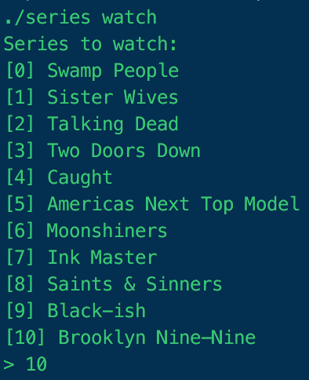
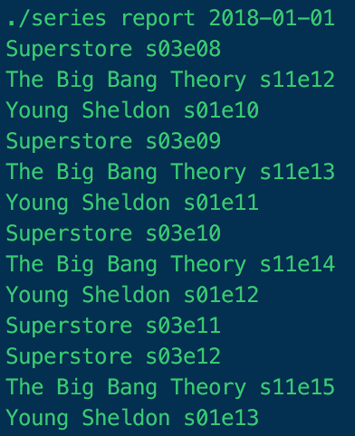

# Series

[](https://github.com/Baptouuuu/Series/actions?query=workflow%3ACI)
[](https://codecov.io/gh/Baptouuuu/Series)

This tool allows you to report the episodes of your tv shows you need to watch.

This project is born to allow to follow your tv shows without the need to use a web service. By using a dedicated web service you tv shows consumption is tracked via the account you need to log into. This tool store your usage in your home folder under the `.series` folder, thus keeping your consumption private.

The technical goal of this project is to showcase the implementation of the [clock pattern](https://github.com/Baptouuuu/talks/tree/master/time%20dependency).

## Installation

```sh
composer global require baptouuuu/series
```

## Usage

The first step is for you to select the series you want to watch:

```sh
series watch
```

This will ask you to choose the series (airing this month) you want to watch. Since this tool doesn't access a global database of tv shows you'll need to run this command every month in order to discover new series.

**Note**: if for some reason you want to stop watching a show simply run `series unwatch`, it will ask you which one you want to stop watching.

Then each time you want to catch up of all episodes you need to watch:

```sh
series report
```

The first time it will retrieve the epsiodes since the last day. But if you want to display episodes since a given date simply add an argument to the command of the form `{year}-{month}-{day}`.

Examples of the commands:

 

## Tech

Below is the dependency graph of this tool in case you want to understand the inner working.


